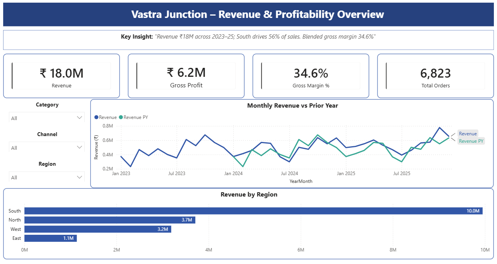
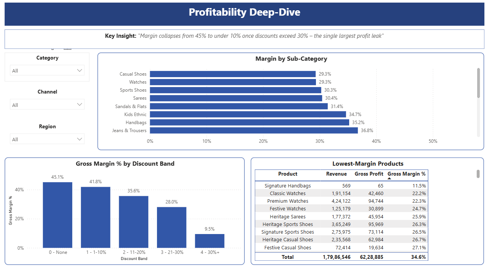

# Vastra Junction — Revenue & Profitability Analysis

**An end-to-end analysis of a retail apparel chain — from raw data to an interactive dashboard — using SQL Server, Excel, and Power BI.**

> *Vastra Junction is a **synthetic** dataset modelling a Bengaluru-headquartered Indian apparel retailer (stores across South, West, North & East India plus an online channel). ~9,600 order lines, Jan 2023 – Dec 2025, all values in ₹ (INR). Figures are illustrative and demonstrate method — they are not a real company's results.*

---

## Business Question

Management wants to know **which categories, regions, and channels drive revenue and gross profit — and where discounting is destroying margin** — so they can decide where to invest inventory and where to pull back on markdowns.

*Stakeholder: Head of Retail / CFO. Decision informed: inventory allocation and discount policy.*

---

## Tools & Skills Demonstrated

| Tool | What it does here |
|---|---|
| **SQL Server (T-SQL)** | Data loading, cleaning (category standardisation, NULL handling, de-duplication), and six analyses using window functions (`LAG`, `RANK`, `ROW_NUMBER`). |
| **Excel** | A three-tab financial model: category P&L with modelled operating profit, a seasonal revenue forecast (`FORECAST.ETS`), and an interactive Base/Optimistic/Pessimistic scenario model — built with zero hardcoded values. |
| **Power BI** | A two-page interactive dashboard: a star-schema data model, DAX measures (including time-intelligence YoY/MoM), and synced slicers for Category, Region, and Channel. |

---

## Key Findings

1. **Discounting past 30% destroys margin.** Gross margin falls from **~45% at full price to under 10% (9.5%)** once discounts exceed 30% — and these deep-discount lines cluster in the January and July end-of-season sales. → *Cap clearance depth or attach minimum-basket conditions.*

2. **Footwear is a revenue–margin trap.** It is the second-largest revenue category (~₹42 lakh) but carries the **lowest gross margin (30.4%)** of the major categories, worsened by higher return rates. → *Tighten size guidance and return policy before expanding the Footwear range.*

3. **Online grows but earns less.** The Online channel runs a lower gross margin (**~32.8%**) than Store (**~35.6%**), driven by deeper discounts and more returns. → *Set a margin floor on online promotions; treat the channel as share-growth, not profit.*

4. **A handful of SKUs bleed money.** The worst product, *Signature Handbags*, returns just **11.5% gross margin** — likely loss-making once operating costs are loaded. → *Review or discontinue the lowest-margin SKUs.*

**The financial stakes:** after modelling operating costs (~28% of revenue), a healthy 34.6% gross margin compresses to a thin **6.6% operating margin** — so at this spread, the discount leakage above is a material threat to profitability. A 3-point gross-margin swing moves operating profit from **₹6.5 lakh to ₹17.3 lakh** (±45%).

---

## Dashboard

**Page 1 — Overview**


**Page 2 — Profitability Deep-Dive**


---

## Approach

1. **SQL Server** — loaded the raw sales file, then built a trusted `clean_sales` view: standardised messy category labels, labelled missing values, removed duplicate rows, and kept returns as real (negative) data. Ran the six core analyses with window functions.
2. **Excel** — imported summary extracts and built a category P&L extended to a modelled operating profit, a 36-month revenue trend with a 6-month seasonal forecast, and a discount-policy scenario model with a live comparison chart.
3. **Power BI** — modelled the full row-level data against a dedicated date table, wrote explicit DAX measures, and built two interactive, cross-filtering pages.

> **Finance treatment (deliberate):** Revenue = net sales, **excluding GST** (a pass-through tax) and **net of returns**. Operating expenses are **modelled** as a % of revenue and clearly flagged as illustrative, not actual.

---

## Results at a Glance

| Category | Net Revenue | Gross Margin % |
|---|---|---|
| Womenswear | ₹54.1 L | 35.2% |
| Footwear | ₹41.6 L | 30.4% |
| Menswear | ₹36.0 L | 38.7% |
| Accessories | ₹34.9 L | 32.9% |
| Kidswear | ₹13.3 L | 39.1% |
| **Total** | **₹1.80 Cr** | **34.6%** |

*Regionally, South drives ~56% of revenue, ahead of North, West, and East.*

---

## Repository Structure

```
vastra-junction-revenue-profitability/
├── README.md
├── sql/
│   ├── 01_create_and_load.sql      -- create table + load
│   ├── 02_data_cleaning.sql        -- trusted clean_sales view
│   ├── 03_analysis.sql             -- the six analyses
│   └── (export queries feeding Excel)
├── excel/
│   └── Vastra_Junction_Revenue_Profitability_Model.xlsx
└── powerbi/
    ├── revenue_profitability.pbix
    ├── clean_sales.csv             -- dashboard data source
    ├── overview.png                -- dashboard screenshot
    └── profitability.png           -- dashboard screenshot
```

---

## How to Reproduce

1. Create a database in SQL Server and run `sql/01` → `02` → `03` in order (load the CSV via SSMS *Tasks → Import Flat File*).
2. The `clean_sales` view feeds both Excel and Power BI. **Reconciliation anchors** — these tie out across all three tools:
   - Net revenue ≈ **₹1,79,86,546**
   - Gross profit ≈ **₹62,28,885**
   - Blended gross margin ≈ **34.6%**
3. Open the Excel model and the `.pbix` to explore the analysis and dashboard.

---

## Notes & Caveats

- **Synthetic data** — findings are directional, demonstrating analytical method, not a real company's performance.
- GST slabs, seasonality (festive peaks, end-of-season sales), and return behaviour are modelled to be realistic for Indian apparel retail.
- Scenario and operating-expense figures are clearly-flagged assumptions, not observed costs.
